# Pandas Analyzer & Data Visualization

## Project Overview

The **Sales Data Analyzer** is a Python-based console application developed to perform data analysis and visualization on CSV datasets. The project demonstrates Python data analysis techniques using Pandas, NumPy, Matplotlib, and Seaborn along with object-oriented programming concepts and menu-driven interaction.

The application allows users to load datasets, explore data, clean missing values, perform mathematical and statistical analysis, generate visualizations, create pivot tables, split data into groups, and save generated plots.

---

## Features

### 1. Load Dataset

* Loads CSV files using Pandas.
* Displays confirmation after successful loading.
* Handles file loading errors using exception handling.

### 2. Explore Data

Allows users to inspect dataset contents.

Displays:

* First 5 rows
* Last 5 rows
* Column names
* Data types
* Dataset information

### 3. Handle Missing Data

Provides options to manage missing values:

* Display rows containing missing values
* Fill missing values with mean
* Drop rows with missing values
* Replace missing values with custom values

### 4. Mathematical Operations

Performs calculations on numerical columns:

* Sum
* Mean
* Maximum value
* Minimum value

### 5. Statistical Analysis

Generates statistical insights:

* Descriptive statistics
* Standard deviation
* Variance
* Percentiles

### 6. Data Visualization

Supports multiple chart types:

* Bar Plot
* Line Plot
* Scatter Plot
* Pie Chart
* Histogram
* Stack Plot
* Box Plot
* Heatmap

### 7. Save Visualization

* Saves generated plots as image files.
* Supports custom filenames.

### 8. Create Pivot Table

* Generates pivot tables for grouped data analysis.

### 9. Split Data

* Splits datasets into groups based on selected columns.

### 10. Search, Sort, and Filter

Allows users to:

* Search records
* Sort data
* Filter records

### 11. Exit Program

* Safely terminates the application.

---

## Concepts Demonstrated

### Python Libraries Used

The project uses:

* Pandas
* NumPy
* Matplotlib
* Seaborn

---

### Built-in Functions

Functions used:

* `input()`
* `print()`
* `len()`
* `dict()`
* `tuple()`

---

### User Defined Functions (UDF)

Functions created by the programmer:

* `load_data()`
* `explore_data()`
* `clean_data()`
* `mathematical_operations()`
* `search_sort_filter()`
* `statistical_analysis()`
* `create_pivot_table()`
* `split_data()`
* `visualize_data()`
* `save_plot()`
* `main()`

---

### Object-Oriented Programming (OOP)

Implemented using:

```python
class SalesDataAnalyzer:
```

Features used:

* Constructor (`__init__`)
* Destructor (`__del__`)
* Methods
* Objects

---

### Exception Handling

Used to handle:

```python
Exception
```

Handles:

* Invalid file paths
* Dataset loading errors

---

## Program Flow

1. User starts the application.
2. Main menu is displayed.
3. User loads a dataset.
4. User selects an operation.
5. Program processes the selected option.
6. Results or visualizations are displayed.
7. User can continue using the application.
8. Program exits safely.


---

## Output Screenshots

### Output 1

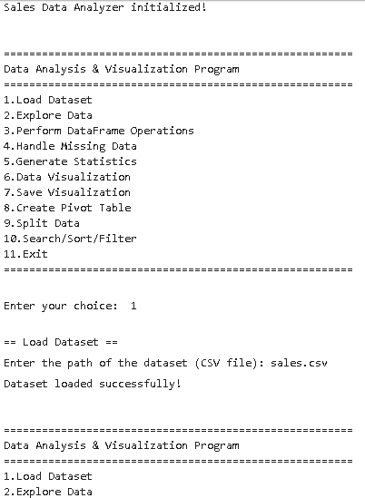

### Output 2

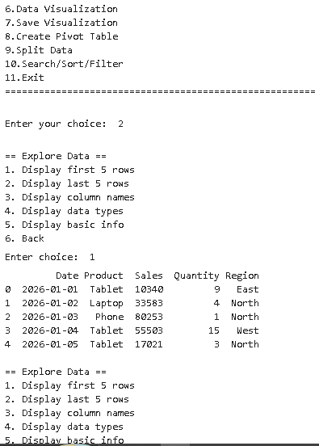

### Output 3

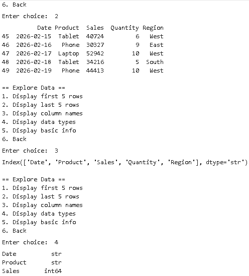

### Output 4

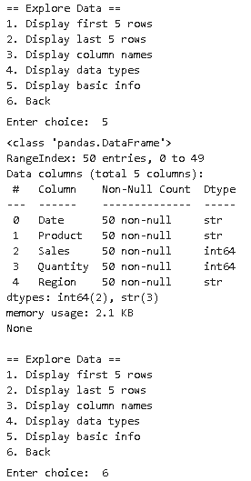


### Output 5

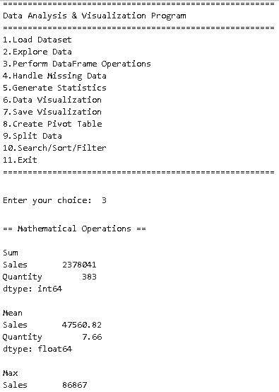

### Output 6

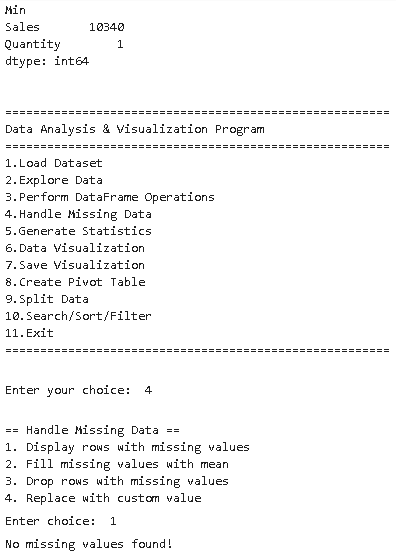

### Output 7

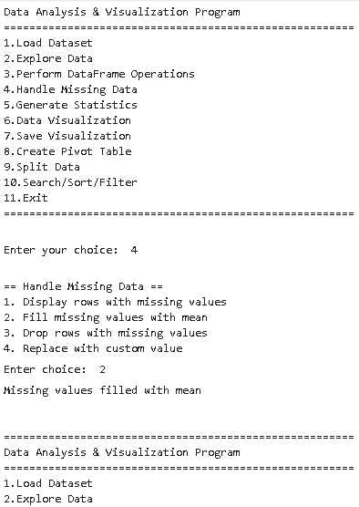

### Output 8

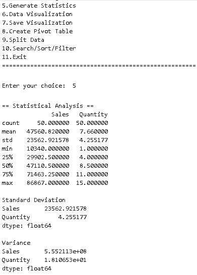

### Output 9

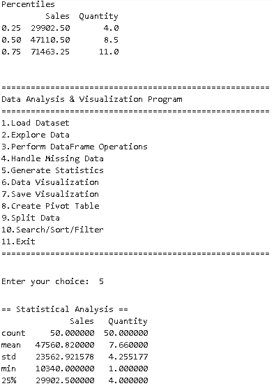

### Output 10

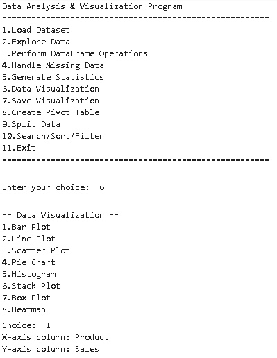

### Output 11

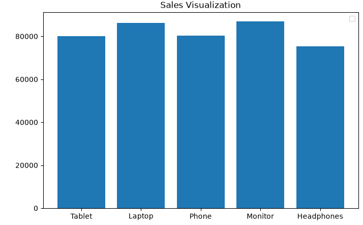

### Output 12

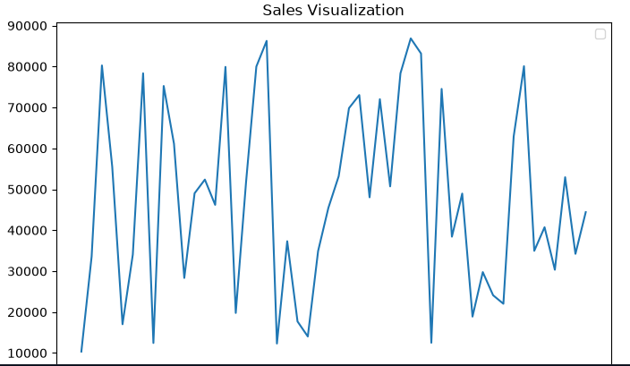

### Output 13

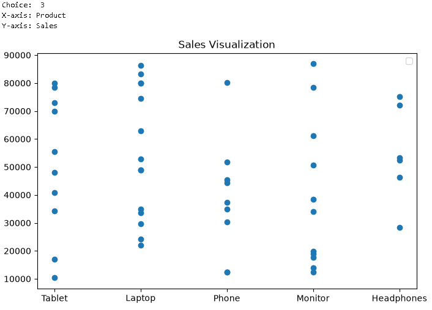

### Output 14

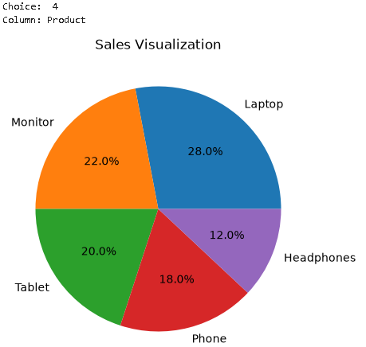

### Output 15

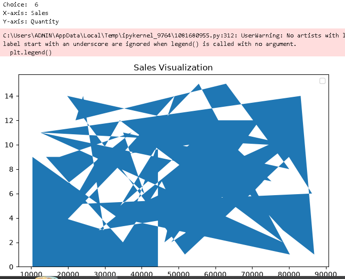

### Output 16

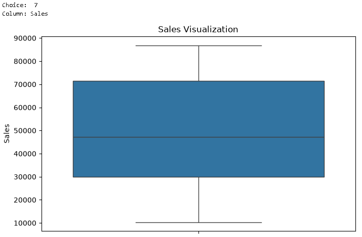

### Output 17

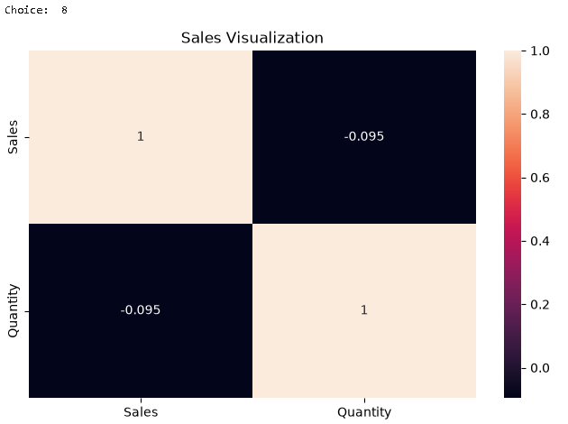

### Output 18

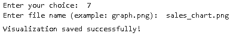

### Output 19

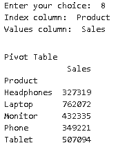

### Output 20

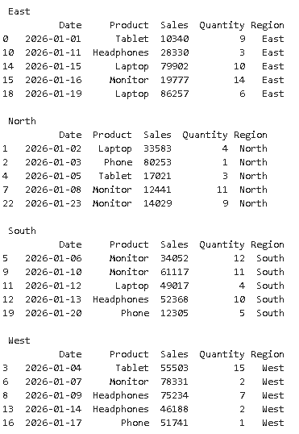

### Output 21

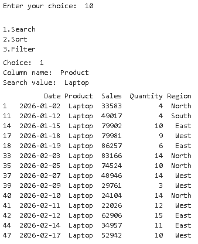

### Output 22

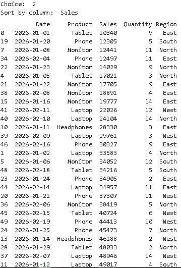

### Output 23

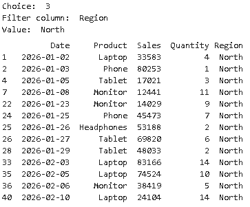

### Output 25

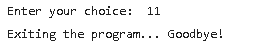

## Project Demo Video

Watch the complete project demonstration here:

[▶ Watch Demo Video](https://drive.google.com/file/d/1iOfn3HovgXBYXlASKGm4qbwmBUe0gjCd/view)

---

## Author

**Sarth Thakar**
